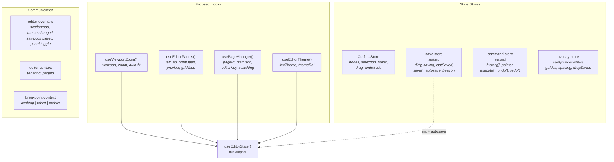
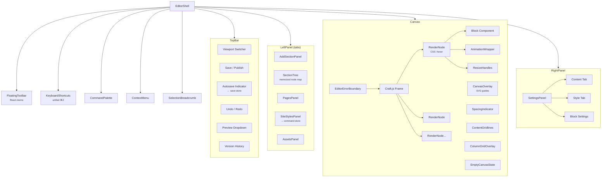
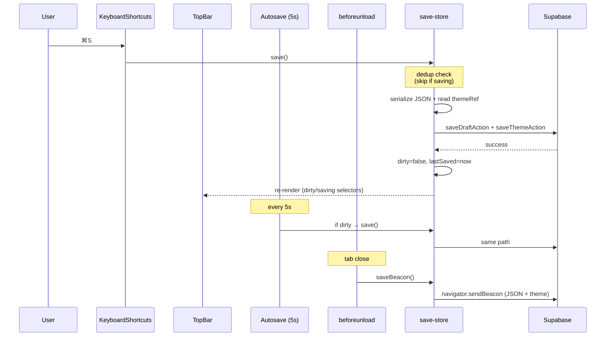
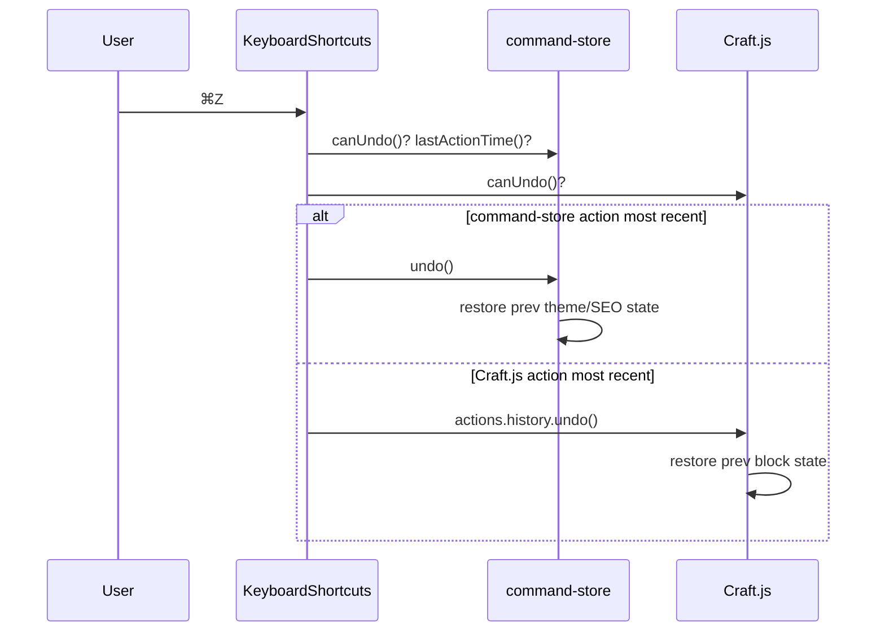
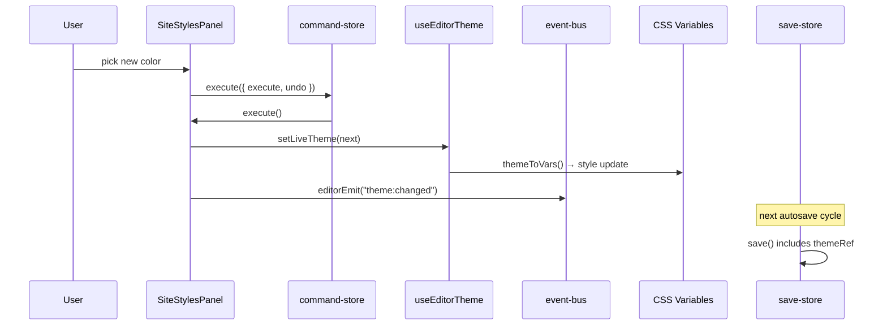
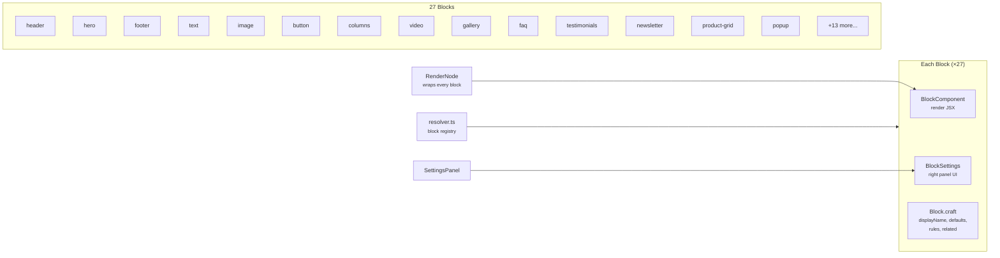

# Editor Architecture Diagram

## State & Data Flow

```mermaid
graph TB
    subgraph Stores["State Stores"]
        CraftJS["Craft.js Store<br/><i>nodes, selection, hover,<br/>drag, undo/redo</i>"]
        SaveStore["save-store<br/><small>zustand</small><br/><i>dirty, saving, lastSaved,<br/>save(), autosave, beacon</i>"]
        CmdStore["command-store<br/><small>zustand</small><br/><i>history[], pointer,<br/>execute(), undo(), redo()</i>"]
        OverlayStore["overlay-store<br/><small>useSyncExternalStore</small><br/><i>guides, spacing, dropZones</i>"]
    end

    subgraph Hooks["Focused Hooks"]
        VZ["useViewportZoom()<br/><i>viewport, zoom, auto-fit</i>"]
        EP["useEditorPanels()<br/><i>leftTab, rightOpen,<br/>preview, gridlines</i>"]
        PM["usePageManager()<br/><i>pageId, craftJson,<br/>editorKey, switching</i>"]
        ET["useEditorTheme()<br/><i>liveTheme, themeRef</i>"]
    end

    Wrapper["useEditorState()<br/><small>thin wrapper</small>"]
    VZ --> Wrapper
    EP --> Wrapper
    PM --> Wrapper
    ET --> Wrapper
    SaveStore -.->|init + autosave| Wrapper

    subgraph Comms["Communication"]
        EventBus["editor-events.ts<br/><i>section:add, theme:changed,<br/>save:completed, panel:toggle</i>"]
        EditorCtx["editor-context<br/><i>tenantId, pageId</i>"]
        BPCtx["breakpoint-context<br/><i>desktop | tablet | mobile</i>"]
    end
```

## Component Tree

```mermaid
graph TB
    Shell["EditorShell"]

    Shell --> TopBar
    Shell --> LeftPanel
    Shell --> Canvas
    Shell --> RightPanel
    Shell --> Floating["FloatingToolbar<br/><small>React.memo</small>"]
    Shell --> KB["KeyboardShortcuts<br/><small>unified ⌘Z</small>"]
    Shell --> CmdPal["CommandPalette"]
    Shell --> CtxMenu["ContextMenu"]
    Shell --> Breadcrumb["SelectionBreadcrumb"]

    subgraph TopBar["TopBar"]
        VP["Viewport Switcher"]
        SaveBtn["Save / Publish"]
        AutoInd["Autosave Indicator<br/><small>← save-store</small>"]
        UndoRedo["Undo / Redo"]
        Preview["Preview Dropdown"]
        History["Version History"]
    end

    subgraph LeftPanel["LeftPanel (tabs)"]
        AddSec["AddSectionPanel"]
        Tree["SectionTree<br/><small>memoized node map</small>"]
        Pages["PagesPanel"]
        Styles["SiteStylesPanel<br/><small>→ command-store</small>"]
        Assets["AssetsPanel"]
    end

    subgraph Canvas["Canvas"]
        ErrBound["EditorErrorBoundary"]
        ErrBound --> Frame["Craft.js Frame"]
        Frame --> RN1["RenderNode<br/><small>CSS :hover</small>"]
        Frame --> RN2["RenderNode"]
        Frame --> RNn["RenderNode..."]
        RN1 --> Block["Block Component"]
        RN1 --> AnimWrap["AnimationWrapper"]
        RN1 --> Resize["ResizeHandles"]
        Overlay["CanvasOverlay<br/><small>SVG guides</small>"]
        Spacing["SpacingIndicator"]
        Grid["ContentGridlines"]
        ColGrid["ColumnGridOverlay"]
        Empty["EmptyCanvasState"]
    end

    subgraph RightPanel["RightPanel"]
        Settings["SettingsPanel"]
        Settings --> Content["Content Tab"]
        Settings --> Style["Style Tab"]
        Settings --> BlockSet["Block Settings"]
    end
```

## Save Flow

```mermaid
sequenceDiagram
    participant User
    participant KB as KeyboardShortcuts
    participant TB as TopBar
    participant AS as Autosave (5s)
    participant BU as beforeunload
    participant SS as save-store
    participant DB as Supabase

    User->>KB: ⌘S
    KB->>SS: save()
    Note over SS: dedup check<br/>(skip if saving)
    SS->>SS: serialize JSON + read themeRef
    SS->>DB: saveDraftAction + saveThemeAction
    DB-->>SS: success
    SS->>SS: dirty=false, lastSaved=now
    SS-->>TB: re-render (dirty/saving selectors)

    Note over AS: every 5s
    AS->>SS: if dirty → save()
    SS->>DB: same path

    Note over BU: tab close
    BU->>SS: saveBeacon()
    SS->>DB: navigator.sendBeacon (JSON + theme)
```

## Undo Flow

```mermaid
sequenceDiagram
    participant User
    participant KB as KeyboardShortcuts
    participant CMD as command-store
    participant CJS as Craft.js

    User->>KB: ⌘Z
    KB->>CMD: canUndo()? lastActionTime()?
    KB->>CJS: canUndo()?

    alt command-store action most recent
        KB->>CMD: undo()
        CMD->>CMD: restore prev theme/SEO state
    else Craft.js action most recent
        KB->>CJS: actions.history.undo()
        CJS->>CJS: restore prev block state
    end
```

## Theme Change Flow

```mermaid
sequenceDiagram
    participant User
    participant SSP as SiteStylesPanel
    participant CMD as command-store
    participant ET as useEditorTheme
    participant EB as event-bus
    participant CSS as CSS Variables
    participant SS as save-store

    User->>SSP: pick new color
    SSP->>CMD: execute({ execute, undo })
    CMD->>SSP: execute()
    SSP->>ET: setLiveTheme(next)
    ET->>CSS: themeToVars() → style update
    SSP->>EB: editorEmit("theme:changed")
    Note over SS: next autosave cycle
    SS->>SS: save() includes themeRef
```

## Block System

```mermaid
graph LR
    subgraph Block["Each Block (×27)"]
        Render["BlockComponent<br/><small>render JSX</small>"]
        Settings["BlockSettings<br/><small>right panel UI</small>"]
        Craft["Block.craft<br/><small>displayName, defaults,<br/>rules, related</small>"]
    end

    Resolver["resolver.ts<br/><small>block registry</small>"] --> Block
    RenderNode["RenderNode<br/><small>wraps every block</small>"] --> Render
    RightPanel["SettingsPanel"] --> Settings

    subgraph Blocks["27 Blocks"]
        B1[header]
        B2[hero]
        B3[footer]
        B4[text]
        B5[image]
        B6[button]
        B7[columns]
        B8[video]
        B9[gallery]
        B10[faq]
        B11[testimonials]
        B12[newsletter]
        B13[product-grid]
        B14[popup]
        Bn[+13 more...]
    end
```
