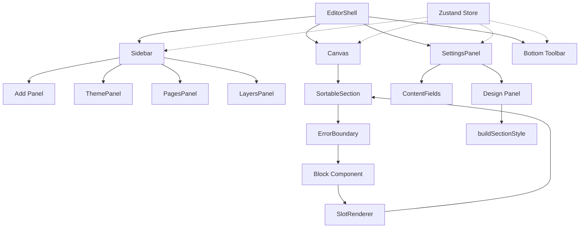

# Editor V2 — Website Builder

Section-based visual editor for building storefronts. 49 blocks, 80+ design controls, real-time preview.

## Architecture



## File Structure

```
editor-v2/
├── store.ts              # Zustand + Immer + Zundo (undo/redo)
├── build-style.ts        # Props → CSS (buildSectionStyle)
├── actions.ts            # Server actions (save, publish, fetch)
├── registry.ts           # Block registration system
├── render.tsx            # Storefront renderer
├── designed-sections.ts  # 8 pre-built section templates
├── blocks/
│   ├── index.ts          # Re-exports (8 lines)
│   ├── register-*.ts     # 6 category files (lazy-loaded)
│   ├── hero.tsx          # ...49 block components
│   └── editable-text.tsx # Inline editing component
├── components/
│   ├── editor-shell.tsx  # Main layout + toolbar
│   ├── canvas.tsx        # Canvas + grid + zoom
│   ├── sortable-section.tsx # Drag + error boundary
│   ├── style-manager.tsx # Design panel (8 sections)
│   ├── settings-panel.tsx # Content + Design tabs
│   ├── add-panel.tsx     # Add section (3 tabs)
│   ├── color-picker.tsx  # HSB picker + eyedropper
│   └── ...               # 20+ panel components
└── __tests__/
    ├── build-style.test.ts  # 30 tests
    └── store.test.ts        # 14 tests
```

## Data Flow

```
User clicks → Store action → Immer mutation → Zundo snapshot
                                    │
                              Zustand notify
                                    │
                    ┌───────────────┼───────────────┐
                    │               │               │
                 Canvas      SettingsPanel      Sidebar
                    │               │
            buildSectionStyle   Field inputs
                    │
              Inline CSS on sections
```

## How to Add a New Block

1. Create `blocks/my-block.tsx` with your component
2. Add to the appropriate `register-*.ts` file:
   ```typescript
   registerBlock('myBlock', {
     component: dynamic(() => import('./my-block').then(m => ({ default: m.MyBlock }))),
     name: 'My Block',
     icon: Box,
     category: 'basic',
     fields: [
       { name: 'title', label: 'Title', type: 'text' },
     ],
     defaultProps: { title: 'Hello' },
   })
   ```
3. Component receives props + `_sectionId` from canvas
4. Use `useBlockMode()` to check editor vs live mode
5. Use `<EditableText>` for inline-editable text fields

## Design Panel Sections

| Section | Controls | CSS Properties |
|---------|----------|----------------|
| Layout | direction, gap, align, wrap, dock, grid | flexbox, grid |
| Spacing | visual box model (padding + margin) | padding, margin |
| Size | W, H, min/max, overflow, aspect ratio | width, height |
| Position | type, offset, z-index, parallax | position, z-index |
| Typography | size, color, align | font-size, color |
| Backgrounds | fill, gradient, image | background |
| Borders | radius, width, color, style | border |
| Effects | opacity, blend, shadow, transform, animation, hover | various |

## Key Patterns

- **Zustand selectors**: Always use `useEditorStore(s => s.field)`, never full destructure
- **Error boundaries**: Each section wrapped in SectionErrorBoundary
- **Container queries**: `@sm:` / `@md:` / `@lg:` instead of `sm:` for responsive preview
- **Ghost inputs**: Transparent bg, border on hover/focus only (Figma UI3 style)
- **Lazy blocks**: All 49 blocks loaded via next/dynamic

## Commands

```bash
npm run dev          # Start dev server
npm test             # Run unit tests (44 tests)
npx playwright test  # Run E2E tests (15 tests)
```
